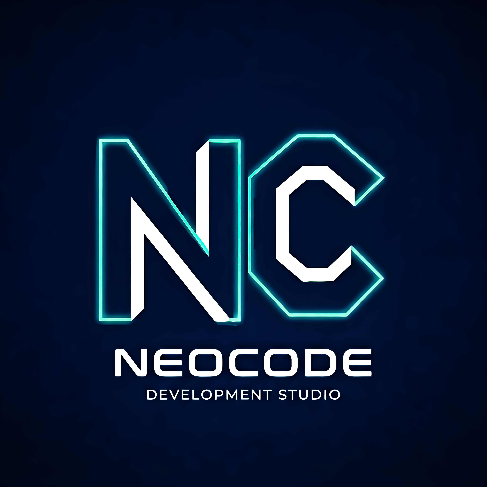

# NeoCode Studio

---

## О студии NeoCode

NeoCode - это динамичная и инновационная студия разработки полного цикла, объединяющая талантливых специалистов. Мы специализируемся на создании современных и эффективных цифровых решений, которые помогают бизнесу расти и развиваться в цифровую эпоху.

Мы используем передовые технологии и лучшие практики разработки, чтобы создавать продукты, которые не только соответствуют требованиям наших клиентов, но и превосходят их ожидания. Наша команда состоит из опытных разработчиков, которые работают в тесном сотрудничестве с клиентами на каждом этапе разработки. Мы гордимся тем, что предоставляем высококачественные решения, которые помогают нашим клиентам достигать своих бизнес-целей и создавать ценность для своих пользователей.

Мы стремимся быть лидерами в области разработки программного обеспечения, постоянно совершенствуя свои навыки и расширяя свои знания, чтобы оставаться на передовой технологической индустрии. В NeoCode мы стремимся максимально удовлетворить потребности наших клиентов, предоставляя им инновационные и эффективные решения, которые помогают им достигать успеха в цифровом мире.

---

## Почему выбирают нас?

- Современные технологии и подходы к разработке
- Индивидуальный подход к каждому проекту
- Гарантия качества
- Команда профессионалов с высоким уровнем навыков
- Поддерка на всех этапах разработки и после запуска продукта
- Конкурентные цены и прозрачное ценообразование
- Быстрое реагирование на запросы и изменения в проекте
- Гибкость и адаптивность к требованиям клиента
- Стремление к инновациям и постоянному совершенствованию наших услуг

---

## Участники команды

### Майор Вулфи
> Middle Fullstack Developer

[Резюме](Майор%20Вулфи.md)

### Андрэ
> Middle Backend Developer

[Резюме](ANDRE.md)

### Shahzod Yigitaliev
> Junior Frontend Developer

[Резюме](SHAHZOD%20YIGITALIEV.md)

### Дмитрий
> Middle Mobile Developer

[Резюме](Дмитрий.md)

---

## Контакты

- 🌐 Сайт: https://NeoCodeStudio.duckdns.org
- 📱 Telegram: @Major_Woolfi

---

## Наши кейсы

### ... - ...

- **Описание:** ...

- **Технологии:** ...

- **Результаты:** ...

---